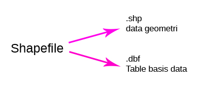
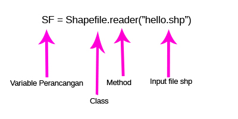
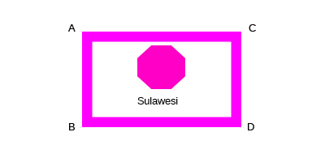

# Sistem Informasi Geografis - Pertemuan 4
RESUME PEMBUATAN METHOD DAN CLASS RETRIEVE DATA GEOSPASIAL

## Latar Belakang Masalah :
Pada Sistem Infomasi Geografis mempunyai 2 garis, yaitu data raster dan data vector. Data raster merupakan cara untuk menentukan tata suatu letak wilayah pada permukaan bumi, sedangkan data vektor merupakan cara menentukan letak wilayah baik atas, bawah, dan juga penentuan berapa jumlah kota dalam suatu lokasi yang ada di permukaan bumi dengan cara menggunakan titik, garis, dan polygon. Cara yang kita gunakan pada penentuan jumlah kota pada suatu lokasi menggunakan python karen tergolong mudah dan sederhana.

1. Apa yang dimaksud Retrieve Data?

2. Apa itu Shapefile?

3. Apa itu Geometri?

4. Bagaimana Operasi Pengambilan Data?

5. Buatlah Class Geospatial Editor?

6. Buat Method Select, Where Negara?

## Isi :

Retrieve data geospasial adalah  suatu cara untuk melakukan select atau view, data record dari file dbf dan geometri dari file shp.

Jadi Shapefile dibagi menjadi dua :

  

SHP merupakan salah satu file yang berada didalam shapefile yang menyimpan data geometri.

Didalam file shp terdapat beberapa data seperti:

dalam shp dibagi menjadi 4 : 

1. Bbox adalah sebuah boundary box (koordinat 4 titik) atau koordinat batas view yang ada pada peta.

  

2. Part ialah apakah record ini bagian dari record lain/ precahan relasi

3. Point adalah titik suatu koordinat

4. Shapetype adalah jenis data geometri yang mempunyai standar nomor yang ditetapkan oleh ESRI

DBF adalah sebuah file yang menyimpan file tabular yang menyimpan data attribut.

Method dari DBF

fields

record(n)

Record (n) baris ke (n) records

Geometri

Data koordinat yang membentuk bangun datar/ruang diantaranya:

1. Point/titik [1]

2. Line/garis [3] Shape,type

3. Polygon [5]

Operasi Pengambilan Data

Library pyshp class shapefile

1. Buka/baca
2.

  

## Praktek

Menampilkan jumlah record melalui terminal

  

Menampilkan jumlah record dengan py shp

  

main.py

  

1. Membuat class geospasial editor,

  

2. Masukan Kode didalam tugas.py

  

3. Buat Method Select, Where Negara (Indonesia)?
Output Data Record Negara Indonesia

  

## Penutup
**Kesimpulan**
Kesimpulan dari penulisan karya tulis ini adalah untuk mengetahui bagaimana cara penggunaan class dan method method dalam memanipulasi retrieve data seperti contoh diatasm menampilan record dari sebuah negara dengan pemanfaatan class dan method

**Saran**
Saran dari saya, alangkah baiknya lakukan praktek langsung pada saat belajar di kelas, agar pada saat tugas mingguan, tidak terlalu susah pada saat mencoba kembali